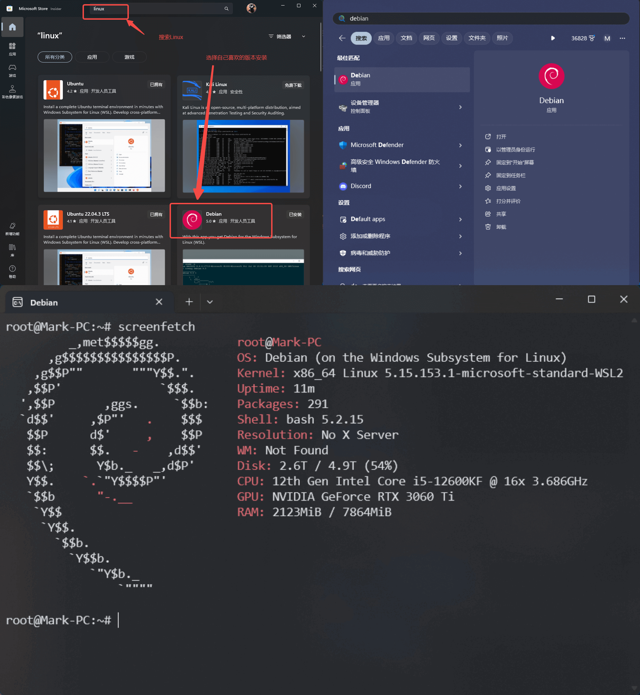

---
category:
  - developer
tag:
  - 工具
  - 技巧
  - 教程

order: 2
permalink: /developer/wsl_ready.html
---

# WSL 子系统的介绍与安装

官方文档：
https://learn.microsoft.com/zh-cn/windows/wsl/

## 为何会需要 WSL ？

一般的程序员都会拥有多台电脑，一台 Mac ，一台 Windows，上班 Mac，下班 Windows。\
敲代码 Mac，打游戏 Windows，甚至可能还有一款 Windows 的笔记本。\
除此之外，还有有多台远程的服务器使用 Linux 系统。

然后，MacOS 和 Linux 大多数时候命令行基本一致，编写好的一些 bash 脚本基本上也是可以通用的。唯独 Windows 比较割裂。

众所周知 `PowerShell` 很好用，但是我不想用。

还有另外一个原因，服务器使用的是 Linux，本地编写的软件用 Windows ，到了服务器结果发现编译失败？这个问题排查起来就很头疼了。

如果存在一种方案，可以在 Windows 下使用 Linux，那岂不是完美? 同一台机器，既可以打游戏，又能写代码，还能用来学习 Linux，还能和服务器拥有一模一样的开发环境！

于是， WSL 诞生了！

> 目前普遍使用 WSL2

## 安装 WSL 子系统

微软官方安装文档：
<https://docs.microsoft.com/zh-cn/windows/wsl/wsl2-index>

当然，官方的安装文档略显复杂，我们这里将会简化这个步骤。

> 当然，以下步骤需要将 Windows 系统更新为最新版本。

## 通过 `Microsoft Store` 安装



简单来说就是:

1. 找到并打开 `Microsoft Store`
2. 搜索 Linux，然后找到自己喜欢的 发行版 并安装
3. 安装完成后打开该发行版，然后按照命令行提示操作就行了

> 如果是第一次安装,可能还会提示需要下载一个核心包，但也是无脑下一步就好了。
> 然后可能还需要你设置个密码啥的

## 基本的一些设置

```bash
## 打开 Powershell 输入
wsl -l -v

## 会显示如下信息
  NAME      STATE           VERSION
* Debian    Running         2

## 输入以下指令默认使用 root 身份登录 Debian
Debian config --default-user root


## 将 wsl 关机
wsl --shutdown

## 输入以下指令可以用 wsl 进入当前目录
wsl

```

效果如图:


> 到了这一步之后，就可以当做普通的 `Linux Debian` 去使用了。

## WSL 配置系统代理

一般情况下，WSL2 的 IP 地址每次启动时都会改变，如果想要在 wsl2 中使用 Windows 的代理，可以使用如下代码。

进入 WSL 在 `~/.bashrc` 中添加如下指令

```bash
#!/bin/bash

host_ip=$(cat /etc/resolv.conf | grep "nameserver" | cut -f 2 -d " ")
export ALL_PROXY="socks5://$host_ip:10808"  ## 这里使用的 socks5 协议，也可以使用 http 协议
```

效果如下


简单来说是以下几步

1. 打开本地的代理工具，设置好端口如 10809
2. 在 wsl 中设置好动态的 ip 脚本
3. 查看 Windows 的系统代理是否 OK
4. 在 WSL 中测试一下是否可以访问 google.com

---
